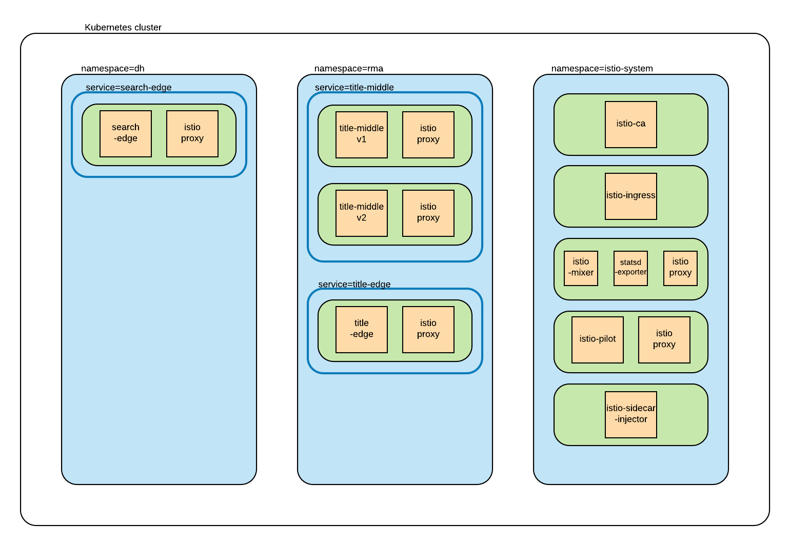

# Kuberenetes + Istio
## Description
The purpose of this project is to create a working example of kubernetes and istio. Additionally, this repo serves as a sandbox environment for experimenting with istio/kubernetes concepts.

## Prerequisites
* bash
* minikube(demo was built on v0.25.2)
* kubectl (demo was built on v1.9)
* docker
* Java 8(minimum)

## System Overview
This demo implements the following system:

Each application is implemented as a Spring Boot web app. 

### Namespace overview
* dh - an application namespace that searches for medical articles
* rma - an application namespace that provides an overall content catalogue  

### Application overview
* title-middle - REST service for retrieving and managing publication titles
* title-edge - REST service for interacting with title-middle and applying any relevant business logic
* search-edge - REST service that searches for medical articles
 
### Current Istio policies
#### title-middle 50/50
Title-middle has two versions (v1 and v2). Istio splits traffic evenly between the two.

#### title-edge ingress
The istio ingress controller is set to route /title-edge/* traffic to title-edge

#### search-edge ingress
The istio ingress controller is set to route /search-edge/* traffic to search-edge

#### TODO: Circuit breaker

## Setup instructions

### After installing minikube/kubectl
Minikube defaults to 2gb of memory. It is strongly recommended that this is increased:

`minikube config set memory 4096`

### run `eval (minikube docker-env)`
All k8s deployments are configured to not pull images from a remote repo, so they must be published locally

### run `scripts/env.sh`
This script will 
* Start minikube 
* Add istio(v0.7.1)
* Enable istio's automatic sidecar injection
* enable minikube's ingress
* set up some initial namespaces

### run `scripts/start.sh`
This script will
* Build all applications as a fat jar, and create docker images for each of them
* Create k8s deployments for each application, spread across the two listed namespaces
* Create k8s services for each application
* Apply istio route and ingress rules

### run `scripts/get_ingress_controller.sh`
This script will
* Log the ip and port of the istio ingress controller for testing purposes

### When done, run `scripts/clean.sh`
This script will
* Remove all k8s deployments, services, route rules, and ingress rules

## Testing
After running `start.sh`, `${istio-ingress-ip}:${istio-ingress-port}/search-edge/search` and `${istio-ingress-ip}:${istio-ingress-port}/title-edge/title?title=something` will be reachable.

These services represent edge services that reside in different namespaces, and consume a middle service. 